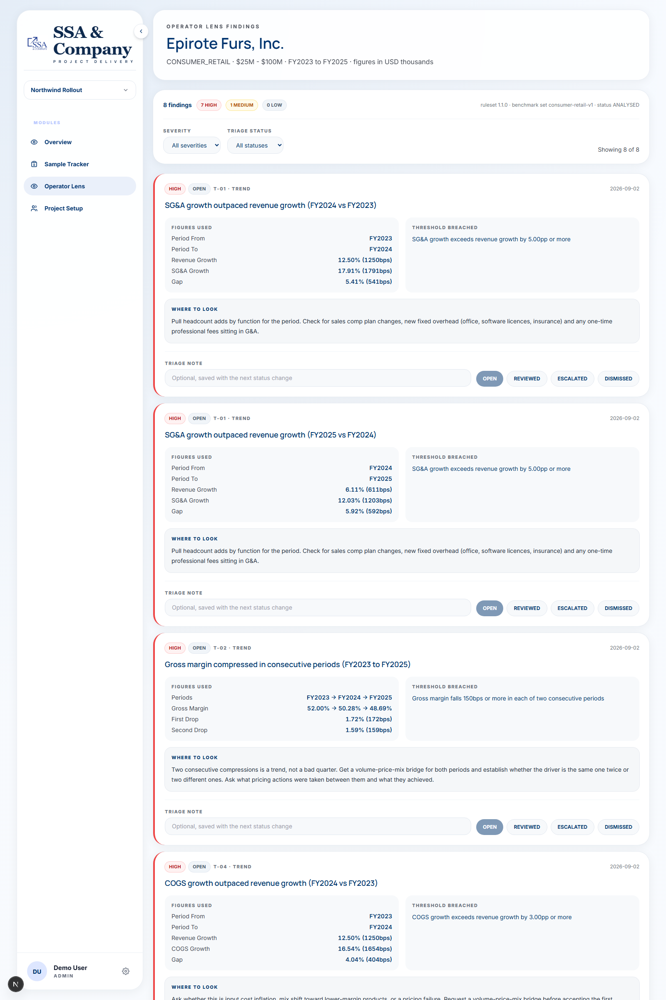

# SSA Pro Module Template

This is a training template. Clone it, run one script, and you get the SSA Pro shell with a working example module. You build your Phase 2 module inside it.

The shell handles the platform parts already: navigation, the project switcher, per-project module gating, a Prisma/SQLite database, and a static demo user. Your job is to add one module that does real work, following the patterns the example module demonstrates.

## What Phase 2 asks you to build

Build one module, spec-driven, through the agent loop. Write a spec, then work with the agent to implement it as a single vertical slice: a data model, a UI, a route, and an API. The example module is the reference for how the pieces fit together. The module built in this repo is Operator Lens, described in "Module: Operator Lens" below.

## Setup and first run

1. On GitHub, click "Use this template" to create your own repo, then clone it.
2. Run `./scripts/run.sh`. It installs dependencies if needed, generates the Prisma client, runs migrations, seeds the database if empty, and starts the dev server.
3. Open http://localhost:3000.

The script is deterministic and safe to run twice. On Windows, run `scripts\run.ps1` instead.


Above is the shell itself. The Operator Lens findings screen is further down.

## The reference vertical slice

The shipped example is Sample Tracker (module key `sampleTracker`, route key `sample-tracker`). It is a project-scoped in-shell module that lists synthetic sample items in a sortable table and lets you add one, persisted to SQLite. Read its files in this order:

1. `packages/db/prisma/schema.prisma` — the `SampleItem` model. Start with the data.
2. `apps/shell/src/apps/sample-tracker/` — the module UI: the workspace component, the sort hook, and the sort util with its unit test.
3. `apps/shell/src/app/(app)/apps/sample-tracker/projects/[projectId]/sample-tracker/page.tsx` — the route, wrapped in `<ModuleGate>`.
4. `apps/shell/src/app/api/apps/sample-tracker/projects/[projectSlug]/items/route.ts` — the API (GET and POST) using `prisma` from `@ssa/db` and `requireProjectAccess` from `@ssa/server`.
5. The registration entries, described next.

## How to add a page or module

Real SSA Pro names a module in three namespaces: `PlatformModule` (Postgres DB enum, UPPER_SNAKE), `ProjectModuleKey` (per-project toggle, camelCase), and `ModuleKey` (nav/routing, kebab-case). This template implements the last two. It has no `PlatformModule` enum because SQLite has no Prisma enums, so module enablement here is static seed data; you add that value only when the module moves to the real platform (see the next section).

Register the module (nav is data-driven, so do not hand-edit the shell chrome):

1. Route/nav key (kebab-case): add it to `ModuleKey` and a `MODULE_REGISTRY` entry in `packages/ui/src/module-registry.ts` (href, match regex, `requiresModule`).
2. Per-project key (camelCase): add it to `ProjectModuleKey` and to `createDefaultModules()` in `packages/project-context/src/project-portfolio.ts`.
3. Nav row: add one row to `PROJECT_MODULE_NAV` in `packages/ui/src/route-groups.ts` (`moduleKey`, `navKey`, `label`).

Then:

- Create the module folder under `apps/shell/src/apps/<module>/`.
- Mount a route under `apps/shell/src/app/(app)/apps/<module>/...`, wrapped in `<ModuleGate projectId moduleKey="<camelKey>">`.
- Add API handlers under `apps/shell/src/app/api/apps/<module>/...` that call `requireProjectAccess(slug, "<camelKey>")` from `@ssa/server/access-service` and use `prisma` from `@ssa/db`.
- Add the Prisma model to `packages/db/prisma/schema.prisma`.
- Generate a migration for it, from `packages/db`: `npx prisma migrate dev --name <descriptive_name>`. This is required. `reset` runs `prisma migrate deploy`, which only replays migrations that already exist, so a schema edit with no migration leaves the tables uncreated with no error. Avoid `npm run migrate:dev -w @ssa/db -- --name <name>`: npm drops the `--name` flag and the command then hangs waiting on a prompt.
- Run `./scripts/reset.sh` (Windows: `scripts\reset.ps1`) to replay migrations and re-seed.

Copy Sample Tracker and adapt it. It exercises every one of these steps.

## Moving your module to real SSA Pro

The layout and call shapes here match the real platform, so a module carries over with two additions: add its `PlatformModule` enum value (UPPER_SNAKE) to the real Postgres schema, and convert any `String` status columns to the platform's Prisma enums. The platform provides auth, audit, and AI wiring through `@ssa/server` and `@ssa/ai-client`; follow the platform's INTEGRATION-PLAYBOOK when you land the module.

## Module: Operator Lens

`operator-lens` (routing) / `operatorLens` (per-project). An income statement analyser for
diligence consultants. It takes a filled-in income statement, compares each period against the
company's own history and against a sourced industry benchmark distribution, and produces a
prioritised list of places to look. Each finding carries the figures it used, the threshold it
breached, the benchmark provenance where relevant, and a specific "where to look" instruction.
The consultant then triages the list down to what matters.

The failure it addresses is not arithmetic. It is context: a 10% gross margin is fatal for
software and unremarkable for a lumber distributor. So nothing is judged in isolation.

This section describes **what is built today**. The wider design, most of which is not built
yet, is in `docs/operator-lens/SPEC.md`, with the build order in `docs/operator-lens/PLAN.md`.



### Running it

```
scripts\run.ps1          # Windows, the tested path
./scripts/run.sh         # macOS and Linux
```

Then open http://localhost:3000, pick the **Northwind Rollout** project, and choose
**Operator Lens** from the Modules nav. The seed loads a synthetic demo company, Epirote Furs,
Inc., with three fiscal years of figures, so the findings screen has content on a clean
checkout.

`scripts\reset.ps1` wipes and reseeds. On Windows, **stop the dev server before running
`./scripts/test.sh`**: `prisma generate` cannot replace its query engine DLL while the server
holds it open, and the run fails with `EPERM`.

### The input workbook

`templates/OperatorLens_Input_Workbook_v1.xlsx` is the Excel file an operator fills in, and
`templates/OperatorLens_Demo_EpiroteFurs.xlsx` is the worked demo the seed reads. Two sheets,
`Company` and `Income Statement`. Column A of each holds a machine code, and
`lib/parse-workbook.ts` reads by those codes rather than by row position, so inserting a row in
the sheet cannot shift a figure onto the wrong line item.

The workbook is the canonical schema every future extractor targets. It is not the intended
primary input, but today it is the only one built.

### The rules

Nine of the fourteen rules in the spec. Thresholds are compared as integer basis points.

Trend axis, needing two or more periods:

| ID | Fires when | Min periods | Severity |
| --- | --- | --- | --- |
| T-01 | SG&A growth exceeds revenue growth by 5.00pp or more | 2 | High |
| T-02 | Gross margin falls 150bps or more in each of two consecutive periods | 3 | High |
| T-03 | Revenue growth is lower than the preceding period's growth rate | 3 | Medium |
| T-04 | COGS growth exceeds revenue growth by 3.00pp or more | 2 | High |
| T-05 | EBITDA margin falls 200bps or more in a period where revenue grows | 2 | High |

Coherence axis:

| ID | Fires when | Min periods | Severity |
| --- | --- | --- | --- |
| C-01 | An entered derived row differs from its recalculation by more than 0.50% | 1 | High |

Derived rows are recalculated from entered primitives, not from other entered derived rows, so
one wrong cell produces one flag rather than cascading down the statement.

Benchmark axis, comparing the most recent period against the seeded distribution:

| ID | Fires when | Min periods | Severity |
| --- | --- | --- | --- |
| B-01 | Gross margin below industry P25 | 1 | High |
| B-02 | SG&A as a percent of revenue above industry P75 | 1 | High |
| B-03 | EBITDA margin below industry P25 | 1 | High |

Rules below their minimum period count are reported as skipped, and benchmark rules with no
seeded row for the industry and size band are reported as unbenchmarked. Neither is reported as
a pass.

### The benchmark peer set

Set version `consumer-retail-v1`, industry `CONSUMER_RETAIL`, **as of 2026-02-01**, **sample
size 8**. Every figure is an XBRL fact from the company's most recent 10-K, pulled from SEC
EDGAR company facts, with the exact concept name and the filing URL recorded per company in
`scripts/analysis/sources/consumer_retail_peers_v1.csv`.

| Ticker | Company | FY end | Revenue |
| --- | --- | --- | --- |
| VRA | Vera Bradley, Inc. | 2026-01-31 | $269.7M |
| LVLU | Lulu's Fashion Lounge Holdings | 2025-12-28 | $282.3M |
| VNCE | Vince Holding Corp. | 2026-01-31 | $300.0M |
| BSET | Bassett Furniture Industries | 2025-11-29 | $335.3M |
| DXLG | Destination XL Group, Inc. | 2026-01-31 | $435.0M |
| BBW | Build-A-Bear Workshop, Inc. | 2026-01-31 | $529.8M |
| TLYS | Tilly's, Inc. | 2026-01-31 | $553.6M |
| DLTH | Duluth Holdings Inc. | 2026-02-01 | $565.2M |

| Metric | P10 | P25 | P50 | P75 | P90 |
| --- | --- | --- | --- | --- | --- |
| Gross margin | 39.18% | 43.39% | 48.04% | 53.97% | 55.94% |
| SG&A % of revenue | 40.11% | 43.21% | 47.17% | 54.08% | 56.06% |
| EBITDA margin | -4.55% | -1.85% | 1.03% | 4.28% | 8.08% |

Percentiles use linear interpolation between closest ranks. EBITDA is tagged operating income
plus D&A, falling back to `revenue - COGS - SG&A + D&A` for the one peer that does not tag
operating income; the CSV records which method each peer used.

Regenerate offline, never at runtime:

```
py scripts/analysis/build_benchmarks.py
```

That reads the committed CSV and writes `packages/db/prisma/benchmarks.v1.json`, which the seed
loads. The app never shells out to Python. Changing the peer set, the percentile method or the
metric definitions changes what every flag compares against, so it needs a new `setVersion`.

Every benchmark comparison on screen renders the full P10 to P90 distribution with a marker for
where the company sits, and the source name, as-of date and sample size directly beneath it. An
unsourced benchmark on screen is a bug.

### Determinism

The same confirmed figures, industry code, benchmark set version and ruleset version produce an
identical set of flags in an identical order, on any machine. How that is held:

- The boundary is confirmed figures, not the uploaded file. Once confirmed, figures are stored
  data, not parser output.
- Everything in `lib/` is pure: no React, no Prisma, no clock, no network, no randomness, no
  model call. The engine lives there, which is what makes determinism testable.
- Money is integer minor units (`BigInt`), never a float.
- Ratios round to 4 decimal places at a single choke point in `lib/metrics.ts`, then convert to
  integer basis points. No float comparison decides whether a flag fires.
- Flag order is fully determined by the input: severity, then axis, then rule id, then title.
- `benchmarkSetVersion` and `rulesetVersion` are stamped on every engagement, so re-running an
  old engagement reproduces what it originally said.
- Benchmarks are passed into the engine, never fetched by it.
- A fired flag stores the distribution it compared against, so the on-screen strip cannot drift
  from what fired.

`determinism.test.ts` asserts identical output across two runs, and that the result does not
depend on the order line items or periods arrive in. `engine.test.ts` has one fixture per rule
that fires exactly that rule, plus a clean company that fires none.

### Known limits

Everything here is a real gap in what shipped, not a design preference.

- **Income statement only.** No balance sheet or cash flow, which removes the strongest
  coherence checks (receivables against revenue, inventory turns).
- **Workbook input only.** PDF, scan, photo, CSV and free-text extraction are not built. The
  spec's primary flow, uploading whatever arrived, does not exist yet. `SourceDocument` and its
  `sourceKind` column are modelled but nothing writes them.
- **No Review and Confirm grid.** This is the spec's mandatory human gate, and it is the most
  significant thing missing. The seed sets `figuresConfirmedAt` directly, so today nothing
  enforces that a human saw a figure before it was analysed. No route bypasses the gate only
  because there is no upload route yet.
- **No scorecard.** The four category scores are not built, so dismissed flags are excluded from
  nothing, and a low-coverage analysis cannot yet be prevented from looking healthy.
- **No engagement list, upload, rules reference or export screens.** Findings is the only
  screen. CSV export does not exist.
- **Five of fourteen rules unbuilt:** B-04, T-06, C-02, C-03, C-04.
- **The benchmark peer set is 7x to 15x larger than the subject.** Peers run $270M to $565M
  against a $38.2M demo company. They are joined on the `$25M - $100M` size band because
  otherwise nothing matches and the benchmark rules never evaluate, so that band is a label of
  convenience rather than a size match. The mismatch is written into the benchmark `source`
  string so it renders on screen. Three peers also sit slightly above a $500M ceiling. Genuinely
  $38M US-listed specialty retailers have largely been delisted or acquired; a real engagement
  needs private-company comparables.
- **One industry, one size band, one currency.** Only `CONSUMER_RETAIL` at `$25M - $100M` in USD
  is seeded. Any other combination gets trend and coherence flags only, reported as
  unbenchmarked.
- **Benchmarks do not stop a version mismatch.** The versions are stamped, but nothing yet
  prevents re-analysing an old engagement against a newer benchmark set.
- **No authentication.** The shell runs as a static Demo User with admin rights, by design in
  Phase 2. `createdByName`, `figuresConfirmedByName` and `ownerName` are plain strings, marked
  `PHASE-3`. Engagements are separated by project, not by person, and `requireProjectAccess` is
  a stub that always grants.
- **The `xlsx` package has two unfixed high-severity advisories** on the npm registry
  (prototype pollution, ReDoS), with no patched version published there. Harmless while the only
  input is a committed fixture, but it parses operator-supplied files by design, so this needs
  resolving before real upload lands.
- **No route-handler or component test coverage.** The 31 passing tests are all pure `lib/`
  logic. The API routes and the workspace component are untested, matching Sample Tracker, which
  has none either.
- **LLM narrative is not built.** `ENABLE_LLM_NARRATIVE` does not exist yet. Nothing in the
  module calls a model, so every screen already renders without one.

Full design: `docs/operator-lens/SPEC.md`. Build order: `docs/operator-lens/PLAN.md`.
